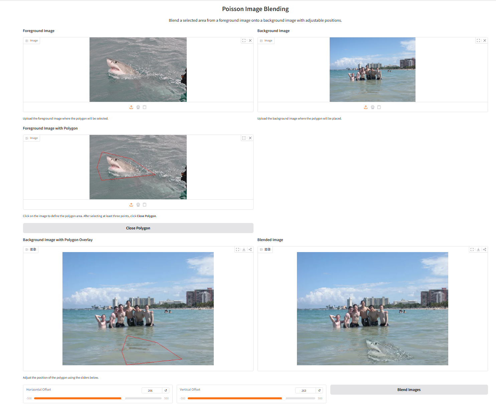
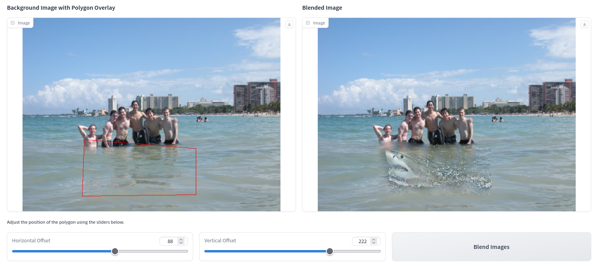
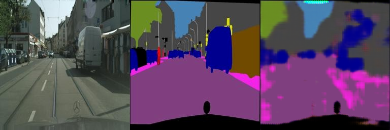

# 02_DIPwithPyTorch

This is an implementation of traditional DIP (Possion Image Editing) and deep learning-based DIP (Pix2Pix) with PyTorch.

## Requirements

To install requirements:

```bash
pip install -r requirements.txt
```

## Poisson Image Editing

### Results





## Deep Learning-Based Pix2Pix

### Datasets

To download `facades` dataset, run this command on Linux:

```bash
bash ./download_facades_dataset.sh
```

To download `cityscapes` dataset, run this command on Linux:

```bash
sed -e 's/facades/cityscapes/g' ./download_facades_dataset.sh | bash
```

### Training

To train the model(s) in the paper, run this command:

```bash
python -u train.py > train.log
```

### Pre-Trained Model

A pre-trained model can be downloaded [here](https://github.com/cleo676767/DIP-Teaching-Assigment-1/edit/main/zuoye2/02_DIPwithPyTorch). Dataset `cityscapes` is used. 

### Results

Validation after 400 epochs:



Validation after 800 epochs:


