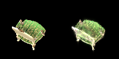
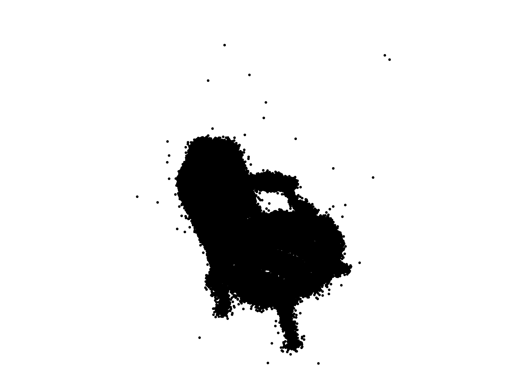
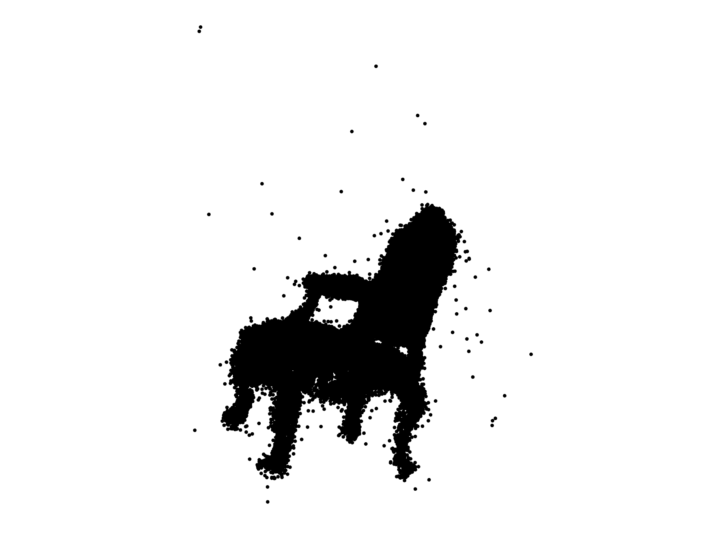

# Assignment 4 - Implement Simplified 3D Gaussian Splatting

## Requirements

To install requirements on Linux:

```bash
cd path/to/04_PlayWithGANs
conda env create -f environment.yml
conda activate 3DGS
```

### Resources:
- [Paper: 3D Gaussian Splatting](https://repo-sam.inria.fr/fungraph/3d-gaussian-splatting/)
- [3DGS Official Implementation](https://github.com/graphdeco-inria/gaussian-splatting)
- [Colmap for Structure-from-Motion](https://colmap.github.io/index.html)

---

### Step 1. Structure-from-Motion
First, using Colmap to recover camera poses and a set of 3D points. 
```
python mvs_with_colmap.py --data_dir data/chair
```

Debug the reconstruction by running:
```
python debug_mvs_by_projecting_pts.py --data_dir data/chair
```

### Step 2. A Simingplified 3D Gaussian Splatting (Your Main Part)
Expanding each point to a 3D Gaussian.

#### 2.1 3D Gaussians Initialization
Refer to the [original paper](https://repo-sam.inria.fr/fungraph/3d-gaussian-splatting/3d_gaussian_splatting_low.pdf). Initialize 3D Gaussians from the input 3D points. Each point is used as the center of a Gaussian, while its covariance, opacity, and color are initialized as optimizable attributes. The covariance matrix is computed from scaling parameters and a rotation quaternion.

#### 2.2 Project 3D Gaussians to Obtain 2D Gaussians
Project the 3D Gaussians from world space to image space. This requires transforming the Gaussians into the camera coordinate system and applying the projection Jacobian to obtain their 2D Gaussian representations.

#### 2.3 Compute the Gaussian Values
Compute the values of the projected 2D Gaussians on the image plane. These values are used as pixel-wise weights for volume rendering and color accumulation:

$$
  f(\mathbf{x}; \boldsymbol{\mu}\_{i}, \boldsymbol{\Sigma}\_{i}) = \frac{1}{2 \pi \sqrt{ | \boldsymbol{\Sigma}\_{i} |}} \exp \left ( {-\frac{1}{2}} (\mathbf{x} - \boldsymbol{\mu}\_{i})^T \boldsymbol{\Sigma}\_{i}^{-1} (\mathbf{x} - \boldsymbol{\mu}\_{i}) \right ) = \frac{1}{2 \pi \sqrt{ | \boldsymbol{\Sigma}\_{i} |}} \exp \left ( P_{(\mathbf{x}, i)} \right )
$$

Here, $\mathbf{x}$ is a 2D vector representing the pixel location, $\boldsymbol{\mu}$ represents a 2D vector representing the mean of the $i$-th 2D Gaussian, and $\boldsymbol{\Sigma}$ represents the covariance of the 2D Gaussian. The exponent part $P_{(\mathbf{x}, i)}$ is:

$$
  P_{(\mathbf{x}, i)} = {-\frac{1}{2}} (\mathbf{x} - \boldsymbol{\mu}\_{i})^T \mathbf{\Sigma}\_{i}^{-1} (\mathbf{x} - \boldsymbol{\mu}\_{i})
$$

You need to fill [the code here](gaussian_renderer.py#L61) for computing the Gaussian values.

#### 2.4 Volume Rendering (α-blending)
The alpha value of a 2D Gaussian $i$ at a single pixel location $\mathbf{x}$ can be calculated using:


$$
  \alpha_{(\mathbf{x}, i)} = o_i*f(\mathbf{x}; \boldsymbol{\mu}\_{i}, \boldsymbol{\Sigma}\_{i})
$$


Here, $o_i$ is the opacity of each Gaussian, which is a learnable parameter.

Given `N` ordered 2D Gaussians, the transmittance value of a 2D Gaussian $i$ at a single pixel location $\mathbf{x}$ can be calculated using:

$$
  T_{(\mathbf{x}, i)} = \prod_{j \lt i} (1 - \alpha_{(\mathbf{x}, j)})
$$

Fill [the code here](gaussian_renderer.py#L83) for final rendering computation.

After implementation, build your 3DGS model:
```
python train.py --colmap_dir data/chair --checkpoint_dir data/chair/checkpoints
```

### Compare with the original 3DGS Implementation
Since we use a pure PyTorch implementation, the training speed and GPU memory usage are far from satisfactory. Run the [original 3DGS implementation](https://github.com/graphdeco-inria/gaussian-splatting) .

## Results

### PyTorch-only

After 100 epochs:



After 200 epochs:


### Original 3DGS





## Acknowledgements

- Thanks to the authors and contributors of [3D Gaussian Splatting](https://repo-sam.inria.fr/fungraph/3d-gaussian-splatting/) and [Colmap for SfM](https://colmap.github.io/index.html). 
